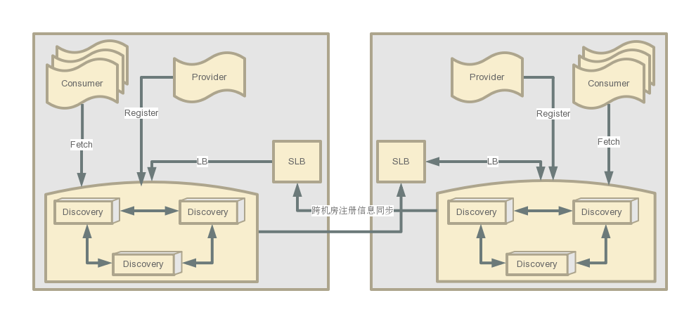

## 设计概览

### 基本概念

0. 通过AppID(服务名)和hostname定位实例
1. Node: discovery server节点
2. Provider: 服务提供者，目前托管给k8s平台，容器启动后发起register请求给Discover server，后定期（30s）心跳一次
3. Consumer: 启动时拉取node节点信息，后随机选择一个node发起long polling(30s一次)拉取服务instances列表
4. Instance: 保存在node内存中的AppID对应的容器节点信息，包含hostname/ip/service等

### 架构图

### 重要步骤

1. 心跳复制(Peer to Peer)，数据一致性的保障：
    * AppID注册时根据当前时间生成dirtyTimestamp，nodeA向nodeB同步(register)时，nodeB可能有以下两种情况：
        * 返回-404 则nodeA携带dirtyTimestamp向nodeB发起注册请求，把最新信息同步：
            1. nodeB中不存在实例
            2. nodeB中dirtyTimestamp较小
        * 返回-409 nodeB不同意采纳nodeA信息，且返回自身信息，nodeA使用该信息更新自身
    * AppID注册成功后，Provider每(30s)发起一次heartbeat请求，处理流程如上
2. Instance管理
    * 正常检测模式，随机分批踢掉无心跳Instance节点，尽量避免单应用节点被一次全踢
    * 网络闪断和分区时自我保护模式
        * 60s内丢失大量(小于Instance总数*2*0.85)心跳数，“好”“坏”Instance信息都保留
        * 所有node都会持续提供服务，单个node的注册和发现功能不受影响
        * 最大保护时间，防止分区恢复后大量原先Instance真的已经不存在时，一直处于保护模式
3. Consumer客户端
    * 长轮询+node推送，服务发现准实时
    * 订阅式，只需要关注想要关注的AppID的Instance列表变化
    * 缓存实例Instance列表信息，保证与node网络不通等无法访问到node情况时原先的Instance可用

### 多注册中心

* 机房定义为zone，表示“可用区”（可能两个相邻机房通过牛逼专线当一个机房用呢~~所以没用IDC~~）
* zoneA使用zoneB的其中一个node地址(只是不需要同步信息)
    * 如zoneA内有node1,node2,node3，zoneB内有nodeI,nodeII,nodeIII
    * zoneA将zoneB的nodeI配入本身配置文件内，当做一个特殊node，同时zoneB将zoneA的node1配入本身当做特殊node（请参考配置文件内zones）
* 跨zone同步数据时，单向同步，zoneB的nodeI收到信息后，nodeI在nodeII,nodeIII之间只做内部广播，不会再次向zoneA的node广播
* 如果有条件可以使用SLB，请参考[B站最佳实践](practice.md)

### 自发现
* Discovery节点上下线自发现，节点之间可以感知到状态
* 客户端SDK可感知节点状态，进行动态添加、移除节点

### 多机房调度
* 支持通过通过下发scheduler信息，进行多机房间的[流量调度](scheduler.md)
* 机房故障或负载过高的情况下，允许通过scheduler将部分流量按比例切换到其他机房。