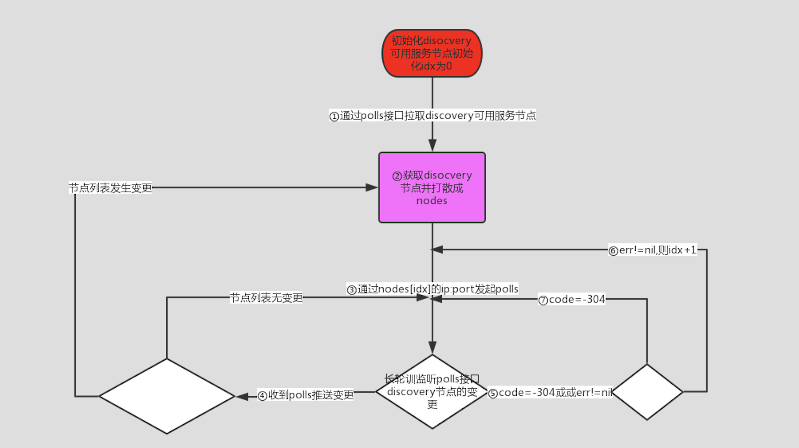
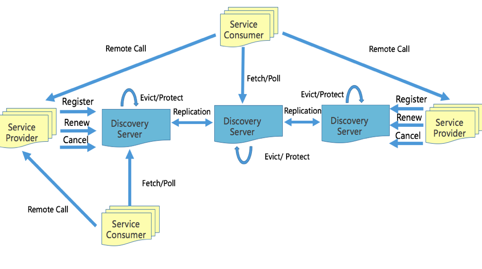

### sdk实现逻辑
#### discovery 服务节点自发现sdk逻辑

1. 调用 http://discovery.bilibili.co/discovery/polls 并指定appid参数为infra.discovery 接口获取discovery服务中心节点信息，获取到discovery的ip:port 节点列表。discovery 服务更新的时候会返回最新的discovery节点信息，sdk需要更新discovery节点信息
2. 将获得的nodes列表的顺序随机打乱后，获取一个随机的nodes节点列表选择第一个节点使用 http://ip:port /discovery/polls 拉取服务节点。poll(polls) 接口为长轮训接口。如果server节点实例没有变更，则接口会阻塞直到30s返回-304 。如果server节点发生变更，则接口立即返回并带上所有instances信息。如果调用失败或服务端返回非-304的code码，则选择列表中后一个节点并进行重试直到成功并记录下当前使用的节点index。(注意: polls接口需要使用①获取到的ip地址进行直连，因为poll为长轮训接口，如果通过域名访问会slb超时)
3. 通过nodes[idx] 发起polls discovery的请求，实时监听discovery nodes节点变更。如果收到poll接口变更推送则进行④，否则进行⑤
4. 收到节点变更推送，对比收到的节点列表与本地旧的列表是否一致 ，如果一致则回到③，否则回到②重新用新的列表打散获取新的nodes
5. 如果polls接口返回err 不为nil则转到⑥，否则如果code=-304转到⑦
6. 收到err不为nil,说明当前节点可能故障，将idx+1 并且last_timestamp设置为0进行节点切换重新回到③发起polls
7. 收到code=-304 说明服务节点无变更，则回到③重新继续polls 

#### 应用发现实现逻辑

1. 选择可用的节点，将应用appid加入poll的appid列表
2. 如果polls请求返回err，则切换node节点，切换逻辑与自发现错误时切换逻辑一致
3. 如果polls返回-304 ，说明appid无变更，重新发起poll监听变更
4. polls接口返回appid的instances列表，完成服务发现，根据需要选择不同的负载均衡算法进行节点的调度